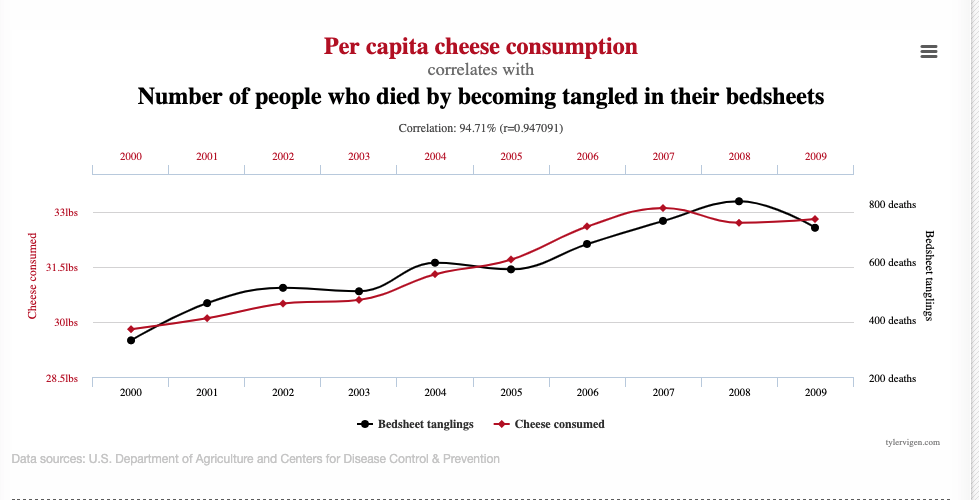

```{r include = FALSE, results = "asis"}
source(here::here("static", "slides", "slide-setup.R"))
```

`r setup("w4p1")`

---
class: inverse-blue
# Data viz in the wild

* Kavya
* Meg


* Anisha
* Rachael

## Zach and Tess on deck

---
class: inverse-red middle
# Reminder

Your final project proposals are due next week. Please look at the syllabus for the requirements.

---

# Agenda 

* Aesthetic mappings and visual encodings of data
* data/ink ratio
* Some do's and don't's (which are all rules 👍)

```{r setup, echo = FALSE, message = FALSE}
knitr::opts_chunk$set(fig.width = 13, 
                      message = FALSE, 
                      warning = FALSE,
                      echo = FALSE)

library(tidyverse)
update_geom_defaults('path', list(size = 3))
update_geom_defaults('point', list(size = 4))
```


```{r source-wilke}
source(here::here("wilke-purl", "wilke-aes-mapping.R"))
source(here::here("wilke-purl", "wilke-avoid_line_drawings.R"))
source(here::here("wilke-purl", "wilke-redundant_coding.R"))
source(here::here("wilke-purl", "wilke-proportions.R"))
```

--
### Learning Objectives
* Understand how decisions you make may help or hinder comprehension

---
class: inverse-red center middle
# Disclaimer
### I'm not a psychologist
I don't really know why we perceive things certain ways.

I mainly care that we do, and that your visualizations should account for them.

---
# Visual Cues
.footnote[Taken from *Modern Data Science with R*, p. 15]

* **Position:** *Numeric*. Where in relation to other things?

* **Length:** *Numeric*. How big (in one dimension)?

* **Angle:** *Numeric*. How wide? Parallel to something else?

* **Direction:** *Numeric*. At what slope? In a time series, going up or down?


---
# Visual Cues

.footnote[Taken from *Modern Data Science with R*, p. 15]

* **Shape:** *Categorical*. Belonging to which group?

* **Area:** *Numeric*. How big (in two dimensions)?

* **Volume:** *Numeric*. How big (in three dimensions)?

* **Shade:** *Numeric or Categorical*. To what extent? How Severely?

* **Color:** *Numeric or Categorical*. To what extent? How Severely?

---
class: middle center
# Encoding data

```{r data-encoding, fig.width = 14}
plot_grid(aes_pos, aes_shape, aes_size,
          aes_color, aes_lwd, aes_ltp,
          ncol = 3,
          labels = c("position", "shape", "size", "color", "line width", "line type"),
          label_x = 0.05, label_y = 0.95, hjust = 0, vjust = 1, 
          label_size = 40)
```

---
# Other elements to consider

* Text
  + How is the text displayed (e.g., font, face, location)? 
  + What is the purpose of the text?

--
* Transparency
  + Are there overlapping pieces? 
  + Can transparency help?

--
* Type of data
  + Continuous/categorical
  + Which can be mapped to each aesthetic?
    - e.g., shape and line type can only be mapped to categorical data, whereas
    color and size can be mapped to either.

---
# Talk with a neighbor
How would you encode each column of data?

| Month | Day | Location     | Station ID  | Temperature |
|:-----:|:---:|:-------------|-------------| :----------:|
|  Jan  |  1  | Chicago      | USW00014819 | 25.6        |
|  Jan  |  1  | San Diego    | USW00093107 | 55.2        |
|  Jan  |  1  | Houston      | USW00012918 | 53.9        |
|  Jan  |  1  | Death Valley | USC00042319 | 51.0        |
|  Jan  |  2  | Chicago      | USW00014819 | 25.5        |
|  Jan  |  2  | San Diego    | USW00093107 | 55.3        |
|  Jan  |  2  | Houston      | USW00012918 | 53.8        |
|  Jan  |  2  | Death Valley | USC00042319 | 51.2        |
|  Jan  |  3  | Chicago      | USW00014819 | 25.3        |

---
# Scales
> A scale defines a unique mapping between data and aesthetics. Importantly, a scale must be one-to-one, such that for each specific data value there is exactly one aesthetics value and vice versa. If a scale isn't one-to-one, then the data visualization becomes ambiguous.

--

* Which data values correspond to specific aesthetic values?

---
class: middle center
# Basic Scales

```{r scales-wilke, fig.width = 14}
scale_num + scale_shape + scale_color + plot_layout(ncol = 1)
```

---
# Putting it to practice

```{r temp-change, fig.width = 14}
ggplot(temps_long, aes(x = date, y = temperature, color = location)) +
  geom_line() +
  scale_x_date(name = "month", 
               limits = c(ymd("0000-01-01"), ymd("0001-01-04")),
               breaks = c(ymd("0000-01-01"), 
                          ymd("0000-04-01"), 
                          ymd("0000-07-01"),
                          ymd("0000-10-01"), 
                          ymd("0001-01-01")),
               labels = c("Jan", "Apr", "Jul", "Oct", "Jan"), 
               expand = c(1/366, 0)) + 
  scale_y_continuous(limits = c(15, 110),
                     breaks = seq(20, 100, by = 20),
                     name = "temperature (°F)") +
  scale_color_OkabeIto(order = c(1:3, 7), name = NULL) +
  theme_minimal(base_size = 25) +
  theme(legend.title.align = 0.5)
```

---
# Basic code for previous plot

```{r echo = TRUE}
ggplot(temps_long, aes(date, temperature)) +
  geom_line(aes(color = location))
```


---
# Change colors
If you want to change the colors on the previous plot, you have to change the colors of the scale for the color mapping.

--

In other words, color is being mapped to data, and you have to change the color scale.

--

```{r echo = TRUE, eval = FALSE}
ggplot(temps_long, aes(date, temperature)) +
  geom_line(aes(color = location)) +
  scale_color_brewer(palette = "Dark2")
```

---
```{r }
ggplot(temps_long, aes(date, temperature)) +
  geom_line(aes(color = location)) +
  scale_color_brewer(palette = "Dark2")
```

---
# One more note on colors
There are lots of different scales and some work better than others. We'll talk about them more next week.


--
You **do not** use `scale_color_*()` if you are not mapping data to color


--
Make sure to keep straight `scale_color_*()` and `scale_fill_*()`

---
# Alternative representation
### Same plot as before, but with different scales

```{r temp-change2, fig.width = 14}
ggdraw(align_legend(p)) 
```


---
# Basic code for previous plot

```{r echo = TRUE, fig.height = 6}
temps_long %>% 
  group_by(location, month) %>% 
  summarize(temp = mean(temperature)) %>% 
  ggplot(aes(month, location)) +
  geom_tile(aes(fill = temp),
            color = "white") +
  coord_fixed()
```

---
# Change the fill

```{r echo = TRUE, fig.height = 6}
temps_long %>% 
  group_by(location, month) %>% 
  summarize(temp = mean(temperature)) %>% 
  ggplot(aes(month, location)) +
  geom_tile(aes(fill = temp),
            color = "white") +
  coord_fixed() +
  scico::scale_fill_scico(palette = "tokyo")
```

---
# Comparison

* Both represent three scales

  + Two position scales (x/y axis)
  + One color scale (categorical for the first, continuous for the second)

* More scales are possible

---

class: center middle
```{r five-scales, fig.width = 10, fig.height = 7}
ggdraw() + 
  draw_plot(p_mtcars + theme(legend.position = "none")) + 
  draw_grob(legend, x = .36, y = .7, width = .7, height = .2)
```

---
background-image:url(http://socviz.co/dataviz-pdfl_files/figure-html4/ch-01-multichannel-1.png)
background-size:contain

## Additional scales can become lost without high structure in the data


---
class: inverse-blue center middle
# Data ink ratio

---
# What is it?

--
> ## Above all else,  show the data

<br>
\-Edward Tufte


--
* Data-Ink Ratio = Ink devoted to the data / total ink used to produce the
figure


--
* Common goal: Maximize the data-ink ratio

---
# Example


--

* First thought might be - Cool!

---
class: inverse-red
background-image:url(https://theamericanreligion.files.wordpress.com/2012/10/lee-corso-sucks.jpeg?w=660)
background-size:cover

---
# Minimize cognitive load
* Empirically, Tufte's plot was **the most difficult** for viewers to
interpret.


--
* Visual cues (labels, gridlines) *reduce* the data-ink ratio, but can also 
reduce cognitive load.

---
# Another example
### Which do you prefer?

.pull-left[
```{r h3_bad, fig.width = 6}
h3_bad
```
]

.pull-right[
```{r h3_good, fig.width = 6}
h3_good
```
]


---
# Advice from Wilke

> Whenever possible, visualize your data with solid, colored shapes rather than with lines that outline those shapes. Solid shapes are more easily perceived, are less likely to create visual artifacts or optical illusions, and do more immediately convey amounts than do outlines.

---
# Another example

.pull-left[
```{r iris_lines, fig.width = 6}
iris_lines
```
]

.pull-right[
```{r iris_colored_lines, fig.width = 6}
iris_colored_lines
```
]

---
class: center middle

```{r iris_filled}
iris_filled
```

---
class: inverse-red middle
background-image:url(img/monstrous-costs.png)
background-size: contain

## This?

---
# The takeaway?
* It can often be helpful to remove "chart junk"
  + Remove background
  + Unnecessary frills
  + Certainly don't use 3D when it's not clearly warranted 


--
### But...

* Infographics can often be more memorable


---
# Compromise?
In some cases, it may be easy and more memorable to use glyphs instead of points or squares

--

* Install packages

```{r install_packages, eval = FALSE, echo = TRUE}
install.packages("extrafont")
remotes::install_github("wch/extrafontdb")
remotes::install_github("wch/Rttf2pt1")
remotes::install_github("hrbrmstr/waffle")
```

--

* Create data

```{r create_data, echo = TRUE}
parts <- c(`Un-breached\nUS Population` = (318 - 11 - 79), 
           `Premera` = 11,
           `Anthem` = 79)
```

---
# Basic plot

```{r waffle1, echo = TRUE}
library(waffle)
waffle(parts, 
       rows = 8, 
       colors = c("#969696", "#1879bf", "#009bda"))
```

---
# Glyph plot
Doesn't seem to work anymore...🤷‍♂️

* Download and install `fontawesome-webfont.ttf` on your machine locally (see [here](https://fontawesome.com/v4.7.0/))

* Import new fonts (including glyphs, via font awesome)

```{r import_fonts, eval = FALSE, echo = TRUE}
library(extrafont)
font_import()
loadfonts()
```

```{r waffle2, echo = TRUE, eval = FALSE}
waffle(parts/10, 
       rows = 3, 
       colors = c("#969696", "#1879bf", "#009bda"),
       use_glyph = "medkit") #<<
```

---
# Should look like this


---
class: inverse center middle
background-image: url(https://pbs.twimg.com/media/DxiychAVYAAJ4CY.jpg)
background-size: 100% 100%

---
# You can create them!
* Create plots

* Use illustrator or similar to put them together

* Add some annotations

* Consider using glyphs for greater memory

* You can do a lot in R without going to illustrator etc. by just using [**{patchwork}**](https://patchwork.data-imaginist.com) or [**{cowplot}**](https://wilkelab.org/cowplot/index.html)


---
class: center middle
# More visual properties


---
# Or in real life

<iframe width="560" height="315" src="https://www.youtube.com/embed/z9Sen1HTu5o" frameborder="0" allow="accelerometer; autoplay; clipboard-write; encrypted-media; gyroscope; picture-in-picture" allowfullscreen></iframe>

---
background-image:url(http://socviz.co/dataviz-pdfl_files/figure-html4/ch-01-dual-search-1.png)
background-size:contain

## Where's the blue circle in each plot?

---
background-image:url(http://socviz.co/assets/ch-01-cleveland-task-types.png)
background-size:contain

# What are we good at perceiving?

---
background-image:url(http://socviz.co/assets/ch-01-heer-bostock-results.png)
background-size:contain


---
background-image:url(http://socviz.co/assets/ch-01-channels-for-cont-data-vertical.png)
background-size:contain

## Ordered 
## data 
## mappings: 
## Ranked


---
# Unordered data mappings


---
class: inverse-blue center middle
# Some things to avoid

---
# Line drawings
### As discussed earlier

.pull-left[
```{r iris_lines2, fig.width = 6}
iris_lines
```
]

.pull-right[
```{r iris_filled2, fig.width = 6}
iris_filled
```
]

---
# Much worse
### Unnecessary 3D

.pull-left[

]

.pull-right[

]

---
# Much worse
### Unnecessary 3D

.pull-left[

]

.pull-right[

]


---
# Horrid example
### Used relatively regularly


---
# Pie charts w/lots of categories


---
# Alternative representation


---
# A case for pie charts
* $n$ categories low,
* differences are relatively large
* familiar for some audiences 

```{r pie, fig.height = 4, fig.width = 10}
wilke_pie
```

---
# The anatomy of a pie chart
Pie charts are just stacked bar charts with a radial coordinate system

```{r stacked_bars_nopie}
ggdraw(bt_bars_stacked)
```

---
# Alternative represenation

```{r horiz_stacked}
ggdraw(bt_bars_hstacked)
```

---
# Or one of these

```{r dodged_bars, fig.height = 4}
bt_bars

ggplot(bundestag, aes(x = fct_reorder(factor(party, levels = bundestag$party), seats), 
                      y = seats, 
                      fill = party)) + 
  geom_col() + 
  geom_text(aes(label = seats), size = 10, hjust = 1.2, color = c("white", "white", "black")) +
  scale_x_discrete(name = NULL) +
  scale_y_continuous(expand = c(0, 0)) +
  scale_fill_manual(values = bundestag$colors[order(bundestag$party)], guide = "none") + 
  theme_dviz_grid(25, font_family = "Roboto Light") +
  theme(axis.ticks.x = element_blank()) +
  coord_flip()
```

---
# Dual axes
* One exception - if second axis is a direct transformation of the first
  + e.g., Miles/Kilometers, Fahrenheit/Celsius 


---
# Another example



.footnote[See more examples [here](http://www.tylervigen.com/spurious-correlations)]
---
# Truncated axes


---
class: middle


---
# Not always a bad thing
> It is tempting to lay down inflexible rules about what to do in terms of producing your graphs, and to dismiss people who don’t follow them as producing junk charts or lying with statistics. But **being honest with your data is a bigger problem than can be solved by rules of thumb** about making graphs. In this case there is a moderate level of agreement that bar charts should generally include a zero baseline (or equivalent) given that bars encode their variables as lengths. But it would be a mistake to think that a dot plot was by the same token deliberately misleading, just because it kept itself to the range of the data instead.

---
# Bars

---
# Points


---
# Law school enrollments


---
# Start at zero


---
# Scaling issues


---
class: middle center
# Poor binning choices


---
class: inverse-blue middle
# Conclusions

---
# Essentially never

* Use dual axes (unles they are direct transformations, just produce separate plots instead)

* Use 3D unnecessarily


--
# Be wary of

  + Truncated axes


--
# Do

* Minimize cognitive load

* Be as clear as possible

---
class: inverse-green middle

# Next time
## Lab 2
We'll replicate some plots produced by [fivethirtyeight](https://fivethirtyeight.com/)