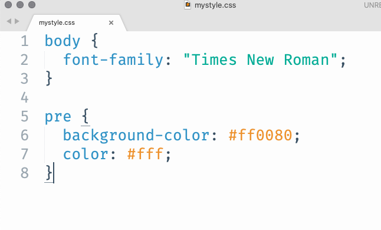
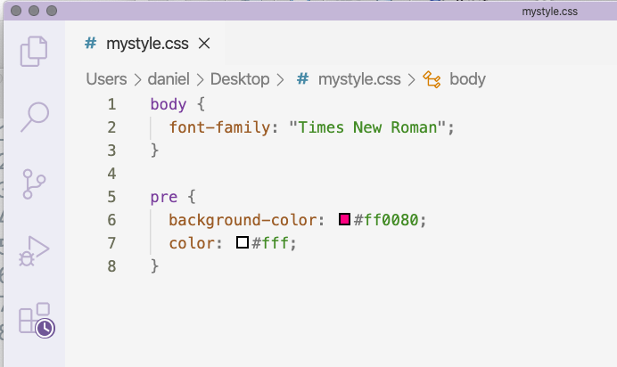

```{r include = FALSE, results = "asis"}
source(here::here("static", "slides", "slide-setup.R"))
```

`r setup("w9p2")`

---
class: inverse-blue
# Data viz in Wild

Sarah Dimakis

---
# Basics of HTML

HTML code is broken up like this

```{html, eval = FALSE}
<body>

  <h1>My First Heading</h1>
  <p>My first paragraph.</p>

</body>
```

--
When we write markdown, things like `# My header` are translated to `<h1>My header</h1>`.

---
# Common HTML tags

|Tag| What it does|
|:----|:----------|
|`<body>`| The body of the document|
|`<h1>`, `<h2>`...`<h6>`| Headers |
| `<b>`, `<u>`, `<i>` | Emphasis (bold, underline, italics)|
| `<br>` | line break|
| `<p>` | paragraph (basically text)|
| `<a>` | link |
| ``| image|
| `<div>`| Generic section|


---
# Modifying these with CSS

Let's start by creating an RMarkdown document


--
Add a code chunk, but swap out `r` for `css`


--
Change the body font to Times New Roman (or whatever else you want) usings something like this

```{css, eval = FALSE}
body {
  font-family: "Times New Roman";
}
```

We specify the thing we want to modify (`body`), then use curly braces, then put the corresponding CSS code. Note the CSS code always follows the form `thing: modifier;`.

---
# Challenge

Play around for three minutes. See if you can do the following

* Use a different font family for Level 1 headers than the rest of the document
* Change the color of the body text or one of the headers (use `color: #hexcode`).
* Try playing with `background-color`.

`r countdown::countdown(3,
  color_running_background = "#22ABF6",
  color_running_text = "#fff"
)`

---
# Using google fonts
Go to [fonts.google.com](https://fonts.google.com/)

Click on a font you're interested in. Once you decide you want it, click "Select this style".

Click the `@import` button, then copy the import code between `<style>` and `</style>`. Put this near the top of your CSS file (or chunk), then use the "CSS rules" to specifically refer to it.

---
# Example google font usage

```{css, eval = FALSE}
@import url('https://fonts.googleapis.com/css2?family=DotGothic16&display=swap');

h1 {
  font-family: 'DotGothic16', sans-serif;
}
```

Note - this might increase the runtime for your page, but usually not significantly.

---
# Inspecting things

I highly recommend using Google Chrome's developer tools. It allows you to hover over things and see the corresponding style. You can even modify the style there to see what changes it will make.

Let's see if we can modify the background color for our code chunks in RMarkdown.

.center[[Demo]]


---
# Creating a style sheet

If you're adding more than a few lines of style (CSS), it might be good to put it all in a single style sheet, then refer to it through the YAML.

Switch

```{yaml, eval = FALSE}
output: html_document
```

to

```{yaml, eval = FALSE}
output: 
  html_document:
    css: mystyle.css
```

--
### Important! The spacing *really* matters here

---
# Writing a stylesheet
I would encourage you to try other text editors for writing style sheets. SublimeText and VS Code are probably the best options.

.pull-left[

]

.pull-right[

]

There are *hundreds* of styles, but the main point is that you can get appropriate code highlighting that you can't get through RStudio (to my knowledge).

---
# Fixing our code output
This is a little complicated... because we changed our code chunks to be white, the code chunk out put just looks like a fully white box.

Using the inspector we can find

```{css, eval = FALSE}
pre:not([class]) {
  ...
}
```

Let's modify this to fix it

```{css, eval = FALSE}
pre:not([class]) {
  color: #ff0080;
}
```


---
# Creating new divs

You can create new divs in any RMarkdown document that uses the newest pandoc (which is most of them; some Hugo themes work better without pandoc)

--
```{r eval = FALSE}
:::attention
Some text
:::
```

is translated to 

```{html, eval = FALSE}
<div class = attention>
  <p>Some text</p>
</div>
```

---
# Modify your div style

Anything that has a *class* can be referred to through CSS by just adding a dot to the beginning. For example, make the text big

```{css, eval = FALSE}
.attention {
  font-size: 2rem;
}
```

The above says make it 2 times it's relative size.


---
# More styling for our div

Let's say we wanted to create a call-out box (i.e., to bring the reader's attention to it). We could keep modifying our `.attention` CSS code to somethign like:

```{css, eval = FALSE}
.attention {
  border: 3px solid #FF0380;
  border-radius: 10px;
  background-color: #ffadd6;
  font-size: 5rem;
  color: #fff;
  text-align: center;
}
```

---
# Referencing elements through their ID

Three basic ways to refer to things in CSS

```{css, eval = FALSE}
/*HTML tag*/
body {
  
}

/*HTML class*/
.attention {
  
}

/*HTML ID*/
#TOC {

}
```

---
# Add TOC, modify appearance

First add a TOC to your YAML

```{yaml}
output: 
  html_document:
    css: mystyle.css
    toc: true
```

Then add something referencing the TOC in your style sheet.

```{css, eval = FALSE}
#TOC {
  border: 2px solid #00FF80;
  background-color: #ccffe8;
  color: #717a75;
  border-radius: 10px;
  width: 20%;
}
```

---
# Links

Let's change the link color and hover effect. We'll do this through two different CSS chunks.

```{css, eval = FALSE}
a {
  color: #009954;
  font-weight: bold;
}

a:hover {
  color: #FF0380;
  text-decoration: none;
}
```


---
# A problem
In our TOC, our text doesn't stand out as much as we might want. Let's change the link style **only** for links in the TOC.

```{css, eval = FALSE}
#TOC a {
  color: #717a75;
}

#TOC a:hover {
  color: #FF0380;
}
```

---
# The `!important` tag

Generally best to avoid, but sometimes it's hard - using this tag will override the standard *cascading* style preference.


```{css, eval = FALSE}
thing {
  background-color: #ff0080 !important;
  color: #fff !important;
}
```

---
class: inverse-blue middle
# Styling flexdashboards

---
# Getting setup

If you're using a flexdashboard for your final project, or you still have the one you created with Akhila, then let's use that.

I'm going to start a new one.

---
# Change the navbar color

A couple of ways to do this - modify `.container-fluid` or `.navbar`.

Let's change the navbar background color and the font. I'll add a bottom border too

--

```{css, eval = FALSE}
@import url('https://fonts.googleapis.com/css2?family=Stick&display=swap');

.container-fluid {
  background-color: #fff;
  font-family: 'Stick', sans-serif;
  border-bottom: 3px solid #00998c;
}
```

---
# Navbar title

Note - this is one area where I couldn't get it to work without the `!important` tag.


```{css, eval = FALSE}
.navbar-brand {
  color: #00998c !important;
  font-size: 5rem;
}
```

---
# Be gone weird other border!

The navbar has an inverse too that you might want to remove or modify

```{css, eval = FALSE}
.navbar-inverse {
  border: none;
}
```

---
# Overall background

```{css}
body {
  background-color: #001413;
}
```

---
# Chart titles

Note I've added another google font. You can do this in a single line of code with `...family=DotGothic16&family=Varela+Round&display=swap...`

```{css, eval = FALSE}
.chart-title {
  background-color: #fff;
  font-family: 'Varela Round', sans-serif;
  color: #00998c;
  font-size: 3rem;
}
```

---
# Panel backgrounds

```{css, eval = FALSE}
.chart-stage {
  background-color: #f5fffe;
}
```

---
# Style plot to match theme

```{r eval = FALSE}
library(ggplot2)
library(showtext)
font_add_google("Varela Round", "vr")
showtext_auto()

ggplot(mtcars, aes(disp, mpg)) +
  geom_point(color = "#001413",
             size = 3) +
  geom_smooth(color = "#00998c",
              fill = "#001413") +
  theme(plot.background = element_rect(fill = "transparent",
                                       color = NA),
        panel.background = element_rect(fill = "transparent",
                                        color = NA),
        panel.grid = element_blank(),
        text = element_text(family = "vr",
                            size = 30,
                            color = "#00998c"),
        axis.text = element_text(color = "#00998c"))
```

You'll want to use `dev.args = list(bg="transparent")` in global knitr chunk options too.

---
class: inverse-blue middle
# Any time left?

## Let's go to distill

---
# Creating a theme
I mentioned  during the distill lecture that you should use the `create_theme()` function to get you started. This will write a stylesheet.

Let's go try. I have not prepared from here, so you can watch me fully wing it and see how it goes.

---
class: inverse-green middle

# Next time
## First round of presentations